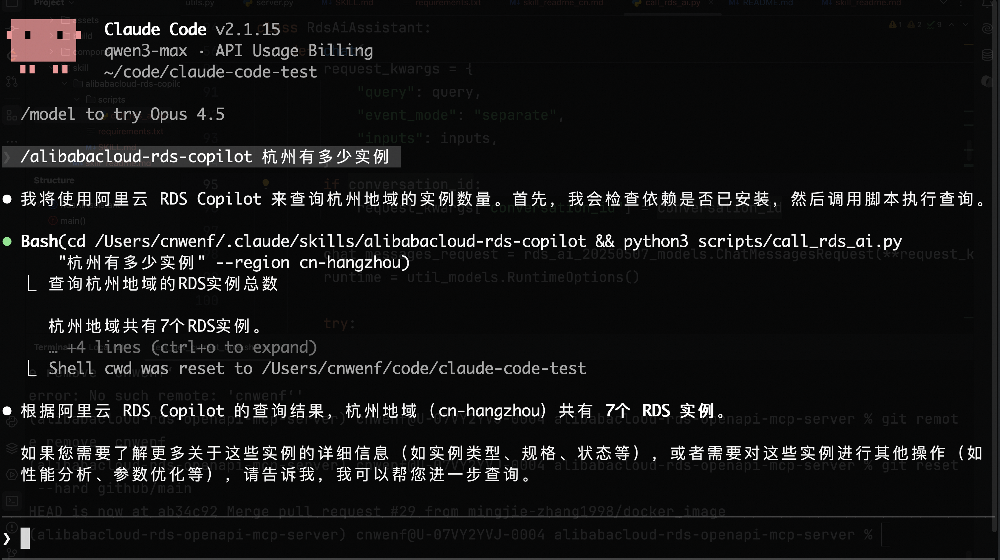

# RDS Skills Documentation

This repository provides multiple skills that can be used with Claude, OpenClaw, Claude Code, and similar platforms:

## Core RDS Skills

1. **alibabacloud-rds-copilot**: Invokes the Alibaba Cloud RDS AI Assistant API for intelligent Q&A, SQL optimization, and troubleshooting.
2. **alibabacloud-rds-instances-manage**: Exposes this project's **RDS OpenAPI tools** and **read-only SQL tools** via a **script/CLI**, so you can manage instances, query monitoring/slow logs/parameters, and run read-only SQL.

## Additional Skills

3. **mcporter**: Use the mcporter CLI to list, configure, auth, and call MCP servers/tools directly (HTTP or stdio), including ad-hoc servers, config edits, and CLI/type generation.
4. **cli-anything**: Generate or refine agent-usable CLIs for existing software/codebases using the CLI-Anything methodology. Turn GUI apps, desktop tools, repositories, SDKs, or web/API surfaces into structured CLIs for agents.
5. **data-analyst**: Data visualization, report generation, SQL queries, and spreadsheet automation. Transform your AI agent into a data-savvy analyst that turns raw data into actionable insights.
6. **arxiv-watcher**: Search and summarize papers from ArXiv. Use when you need the latest research, specific topics on ArXiv, or a daily summary of AI papers.
7. **duckdb-cli-ai-skills**: DuckDB CLI specialist for SQL analysis, data processing and file conversion. Use for SQL queries, CSV/Parquet/JSON analysis, database queries, or data conversion.
8. **self-improving-agent**: Captures learnings, errors, and corrections to enable continuous improvement. Use when commands fail, users correct you, or better approaches are discovered.

---

## I. RDS Copilot Claude Skill (RDS AI Assistant)

The Alibaba Cloud [RDS AI Assistant](https://help.aliyun.com/zh/rds/apsaradb-rds-for-mysql/rds-copilot-overview) Claude Skill lets you invoke RDS AI assistant capabilities directly in Claude conversations for SQL optimization, instance operations, troubleshooting, and more.




## Requirements

### Enable RDS AI Assistant Professional Edition
- [Alibaba Cloud RDS AI Assistant](https://rdsnext.console.aliyun.com/rdsCopilotProfessional/cn-hangzhou) Professional Edition must be enabled

### Python Version

- **Python 3.7+** (Python 3.8 or higher recommended)

Verify your Python version:
```bash
python3 --version
```

## Quick Start

### 1. Clone the Repository

```bash
git clone https://github.com/aliyun/alibabacloud-rds-openapi-mcp-server
cd alibabacloud-rds-openapi-mcp-server/skill
```

### 2. Install Dependencies

Install uv:

```bash
curl -LsSf https://astral.sh/uv/install.sh | sh
```

### 3. Configure Environment Variables

Set up Alibaba Cloud access credentials (required):

**macOS / Linux:**
```bash
export ALIBABA_CLOUD_ACCESS_KEY_ID="your-access-key-id"
export ALIBABA_CLOUD_ACCESS_KEY_SECRET="your-access-key-secret"
```

**Windows (PowerShell):**
```powershell
$env:ALIBABA_CLOUD_ACCESS_KEY_ID="your-access-key-id"
$env:ALIBABA_CLOUD_ACCESS_KEY_SECRET="your-access-key-secret"
```

**Permanent Configuration (Recommended):**

Add the above commands to your shell configuration file:
- Bash: `~/.bashrc` or `~/.bash_profile`
- Zsh: `~/.zshrc`
- Windows: System Environment Variables

### 4. Deploy Skill to Claude

Copy the Skill files to Claude's skills directory:

**Method 1: Use Repository Structure Directly**

If you're using Claude Desktop or an environment that supports custom skills, this repository already includes the correct directory structure `alibabacloud-rds-copilot/` and can be used directly.

**Method 2: Copy to User-Level Skills Directory**

```bash
# macOS / Linux
mkdir -p ~/.claude/skills/
cp -r alibabacloud-rds-copilot ~/.claude/skills/

# Windows (PowerShell)
New-Item -ItemType Directory -Path "$env:USERPROFILE\.claude\skills\" -Force
Copy-Item -Recurse "alibabacloud-rds-copilot" "$env:USERPROFILE\.claude\skills\"
```

**Method 3: Create Symbolic Link (Recommended for Development)**

```bash
# macOS / Linux
mkdir -p ~/.claude/skills/
ln -s "$(pwd)/alibabacloud-rds-copilot" ~/.claude/skills/alibabacloud-rds-copilot

# Windows (Requires Administrator Privileges)
New-Item -ItemType SymbolicLink -Path "$env:USERPROFILE\.claude\skills\alibabacloud-rds-copilot" -Target "$(Get-Location)\alibabacloud-rds-copilot"
```

### 5. Verify Installation

Run Claude and select the alibabacloud-rds-copilot skill:

```bash
claude
```
```bash
/alibabacloud-rds-copilot How many instances do I have in Hangzhou?
```

Expected output:
```
[Query] List RDS instances in Hangzhou region
[Region] cn-hangzhou | [Language] zh-CN
============================================================
[RDS Copilot Response]
<Actual response from RDS Copilot>

[Session ID] conv-xxxx-xxxx-xxxx
```

## Usage

### Basic Usage

Ask RDS-related questions directly in Claude conversations:

```
You: What MySQL instances are available in Hangzhou region?
Claude: [Calls RDS Copilot and returns results]

You: For instance rm-xxx, help me analyze and optimize this SQL: SELECT * FROM users WHERE status=1 ORDER BY created_at
Claude: [Calls RDS Copilot for SQL optimization suggestions]
```

## Troubleshooting

### 1. Module `alibabacloud_rdsai20250507` Not Found

**Cause**: Dependencies not installed or using incorrect Python environment.

**Solution**:
```bash
# Use pip3 to ensure installation in Python 3 environment
pip3 install -r alibabacloud-rds-copilot/requirements.txt

# Verify installation
pip3 list | grep alibabacloud
```

### 2. Environment Variables Not Set

**Error message**:
```
Alibaba Cloud access credentials not found. Please set environment variables:
  ALIBABA_CLOUD_ACCESS_KEY_ID
  ALIBABA_CLOUD_ACCESS_KEY_SECRET
```

**Solution**:
Follow the "Configure Environment Variables" section to set AccessKey and Secret.

### 3. Claude Doesn't Recognize the Skill

**Cause**: Skill files not properly deployed to Claude skills directory.

**Solution**:
- Check if `alibabacloud-rds-copilot/SKILL.md` exists
- Confirm the Skill directory structure is complete
- Restart Claude application

### 4. Error Using `python` Command

**Cause**: System's `python` command points to Python 2 or is not configured.

**Solution**:
Use `python3` command consistently:
```bash
python3 alibabacloud-rds-copilot/scripts/call_rds_ai.py "your query"
```

---

## II. Alibabacloud RDS Instances Manage (OpenAPI + SQL tools via CLI)

**alibabacloud-rds-instances-manage** exposes this project's MCP tools as a **script/CLI** for use with **OpenClaw**, **Claude Code**, and similar platforms. The model runs `alibabacloud-rds-instances-manage list` and `alibabacloud-rds-instances-manage run <tool_name> '<JSON args>'` to call RDS OpenAPI and read-only SQL capabilities and manage RDS instances.

### Capabilities

- **OpenAPI tools**: Query instance list/details, available zones/classes, monitoring, slow logs, parameters, accounts, databases, whitelist; create/update instances and accounts, change parameters/specs, restart, allocate public connection, etc.
- **SQL tools**: Run read-only operations such as `query_sql`, `explain_sql`, `show_create_table`, `show_engine_innodb_status`, `show_largest_table`, `show_largest_table_fragment`, etc.

### Installation and configuration

1. **Install the package** (either approach):
   - From the repository root: `uv pip install -e .` or `pip install -e .`
   - After installation, the `alibabacloud-rds-instances-manage` command is available.

2. **Environment variables** (same as the MCP server):
   - `ALIBABA_CLOUD_ACCESS_KEY_ID`, `ALIBABA_CLOUD_ACCESS_KEY_SECRET` (required)
   - Optional: `ALIBABA_CLOUD_SECURITY_TOKEN`, `MCP_TOOLSETS` (default: `rds`)

### CLI usage

```bash
# List currently enabled tools (JSON output)
alibabacloud-rds-instances-manage list

# Run a tool; arguments are a JSON string
alibabacloud-rds-instances-manage run describe_db_instances '{"region_id":"cn-hangzhou"}'
alibabacloud-rds-instances-manage run describe_db_instance_attribute '{"region_id":"cn-hangzhou","db_instance_id":"rm-xxxxx"}'
alibabacloud-rds-instances-manage run get_current_time '{}'
```

If the package is not installed in the environment, run via module from the repository root:

```bash
uv run python -m alibabacloud_rds_openapi_mcp_server.run_tool list
uv run python -m alibabacloud_rds_openapi_mcp_server.run_tool run describe_db_instances '{"region_id":"cn-hangzhou"}'
```

### Integrating with OpenClaw / Claude Code

1. **Deploy the skill directory**  
   Copy or link `skill/alibabacloud-rds-instances-manage/` into the platform's skills directory, for example:
   - OpenClaw: `~/.openclaw/workspace/skills/alibabacloud-rds-instances-manage/`
   - Claude Code: `~/.claude/skills/alibabacloud-rds-instances-manage/` or project-local `.claude/skills/alibabacloud-rds-instances-manage/`

2. **Configure entries and set env (recommended)**  
   This skill requires the environment variables `ALIBABA_CLOUD_ACCESS_KEY_ID` and `ALIBABA_CLOUD_ACCESS_KEY_SECRET`. It is recommended to configure **entries** for `alibabacloud-rds-instances-manage` and set these in `env` so they are available when the skill runs, without configuring them elsewhere.
   - **OpenClaw**: Edit `~/.openclaw/openclaw.json` and add under `skills.entries`:
     ```json
     "alibabacloud-rds-instances-manage": {
       "enabled": true,
       "env": {
         "ALIBABA_CLOUD_ACCESS_KEY_ID": "your-access-key-id",
         "ALIBABA_CLOUD_ACCESS_KEY_SECRET": "your-access-key-secret"
       }
     }
     ```
   - Optional: add `ALIBABA_CLOUD_SECURITY_TOKEN` (for STS) or `MCP_TOOLSETS` (e.g. `"rds,rds_custom_read"`) in the same `env`.
   - **Claude Code and others**: In the skill's "entries" or "environment variables" configuration, set the two env vars above for `alibabacloud-rds-instances-manage`.

3. **Ensure the CLI is available**  
   After installing the package, ensure `alibabacloud-rds-instances-manage` runs in the terminal. The model will follow the instructions in SKILL.md and call `alibabacloud-rds-instances-manage list` and `alibabacloud-rds-instances-manage run <name> '<json>'`.

4. **Skill contents**  
   - `skill/alibabacloud-rds-instances-manage/SKILL.md`: Skill name, description, when to use it, standard workflow, **entries configuration**, and tool quick reference.
   - `skill/alibabacloud-rds-instances-manage/tools_reference.md`: Tool names and parameter reference.
   - `skill/alibabacloud-rds-instances-manage/skill.yaml`: Metadata for OpenClaw/ClawHub (optional).